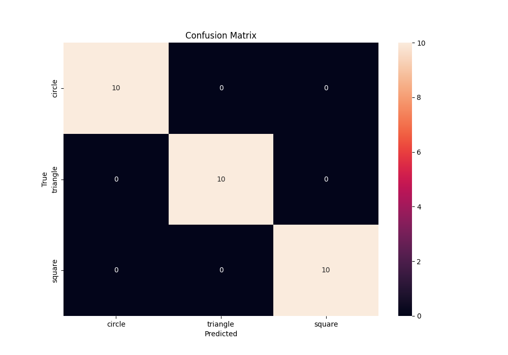

# Deep Learning Vision: A CNN Portfolio Project

This project is a comprehensive Proof-of-Concept (POC) for deep learning in computer vision, focusing on image classification using various Convolutional Neural Network (CNN) architectures. It is designed to be a strong portfolio piece for MLOps and Deep Learning roles, showcasing not just model implementation but also experiment tracking, model serving, and thorough documentation.

## Table of Contents

- [Core Concepts](#core-concepts)
  - [LeNet-5](#lenet-5)
  - [ResNet](#resnet)
  - [EfficientNet](#efficientnet)
  - [DenseNet](#densenet)
- [Project Structure](#project-structure)
- [Installation Guide](#installation-guide)
- [Usage](#usage)
  - [1. Data Generation](#1-data-generation)
  - [2. Model Training](#2-model-training)
  - [3. Experiment Tracking with MLflow](#3-experiment-tracking-with-mlflow)
  - [4. Serving the Model with FastAPI](#4-serving-the-model-with-fastapi)
- [Results](#results)
- [Technologies Used](#technologies-used)

---

## Core Concepts

This project explores four foundational CNN architectures for image classification.

### LeNet-5

**Concept:** LeNet-5 is one of the earliest and most foundational CNN architectures, developed by Yann LeCun in 1998 for handwritten digit recognition. It established the standard CNN structure of sequential convolutional and pooling layers followed by fully connected layers for classification.

**Mathematical Deduction:**
The architecture consists of 7 layers:
1.  **C1 (Convolutional):** 6 filters of size 5x5. The output size is `(32-5+1)x(32-5+1) = 28x28`.
2.  **S2 (Subsampling/Pooling):** Average pooling with a 2x2 filter and a stride of 2. The output size is `28/2 x 28/2 = 14x14`.
3.  **C3 (Convolutional):** 16 filters of size 5x5. The output size is `(14-5+1)x(14-5+1) = 10x10`.
4.  **S4 (Subsampling/Pooling):** Average pooling with a 2x2 filter and a stride of 2. The output size is `10/2 x 10/2 = 5x5`.
5.  **C5 (Fully Connected):** 120 neurons.
6.  **F6 (Fully Connected):** 84 neurons.
7.  **Output Layer:** Softmax layer with `n` outputs, where `n` is the number of classes.

**Industry Use-Cases:**
-   Basic image classification tasks.
-   Handwriting and digit recognition (its original purpose).
-   A baseline for more complex models.

### ResNet (Residual Network)

**Concept:** Introduced in 2015, ResNet addresses the vanishing gradient problem in very deep networks. It introduces "residual blocks" where the input to a block is added to its output via a "skip connection." This allows the network to learn an identity function, ensuring that deeper layers do not degrade performance.

**Mathematical Deduction:**
A standard convolutional block learns a mapping `H(x)`. A residual block, however, learns a residual function `F(x) = H(x) - x`. The output is then `y = F(x) + x`. This formulation makes it easier for the optimizer to learn an identity mapping (by driving the weights of `F(x)` to zero) if a layer is not needed.

**Equation:**
`y = F(x, {W_i}) + x`

**Industry Use-Cases:**
-   Image classification and recognition at scale (e.g., in social media photo tagging).
-   Object detection and segmentation.
-   Medical image analysis.

### EfficientNet

**Concept:** EfficientNet, proposed in 2019, provides a systematic way to scale CNNs. Instead of scaling only one dimension (width, depth, or resolution), EfficientNet uses a compound scaling method that uniformly scales all three dimensions with a fixed set of scaling coefficients. This results in better performance and efficiency.

**Mathematical Deduction:**
The core idea is to scale the network dimensions using a compound coefficient `φ`:
-   **Depth (d):** `d = α^φ`
-   **Width (w):** `w = β^φ`
-   **Resolution (r):** `r = γ^φ`

Where `α, β, γ` are constants found via a grid search on the baseline network (EfficientNet-B0).

**Industry Use-Cases:**
-   Mobile and edge computing devices where computational resources are limited.
-   Real-time image and video analysis.
-   Applications where both high accuracy and low latency are critical.

### DenseNet (Densely Connected Network)

**Concept:** DenseNet, introduced in 2017, takes the idea of skip connections to the extreme. In a DenseNet, each layer is connected to every other layer in a feed-forward fashion. For each layer, the feature maps of all preceding layers are used as inputs, and its own feature maps are used as inputs into all subsequent layers.

**Mathematical Deduction:**
This dense connectivity encourages feature reuse, alleviates the vanishing gradient problem, and reduces the number of parameters. The output of the `l`-th layer is:

`x_l = H_l([x_0, x_1, ..., x_{l-1}])`

Where `[x_0, x_1, ..., x_{l-1}]` refers to the concatenation of the feature maps from layers 0 to `l-1`.

**Industry Use-Cases:**
-   Medical imaging, where feature reuse can help in identifying subtle patterns.
-   Satellite image analysis.
-   Any application where maximizing feature extraction is crucial.

---

## Project Structure

```
c:\Users\2185206\cnn/
├───LICENSE
├───README.md
├───requirements.txt
├───serve_fastapi.py
├───train.py
├───.git/...
├───models/
│   └───cnn_pretrained_1756968483.pt
└───utils/
    └───io_utils.py
```

---

## Installation Guide

1.  **Clone the repository:**
    ```bash
    git clone <your-repo-url>
    cd cnn
    ```

2.  **Create a virtual environment (recommended):**
    ```bash
    python -m venv venv
    source venv/bin/activate  # On Windows, use `venv\Scripts\activate`
    ```

3.  **Install the dependencies:**
    ```bash
    pip install -r requirements.txt
    ```

    **For GPU support**, it is recommended to install PyTorch with CUDA support. Please follow the instructions on the [official PyTorch website](https://pytorch.org/get-started/locally/).

---

## Usage

### 1. Data Generation

The project includes a script to generate a synthetic dataset of geometric shapes.

```bash
python src/data/generate_data.py
```

This will create a directory `data/raw/images` with 150 images and a `data/raw/labels.csv` file.

Next, process the data and split it into training and testing sets:

```bash
python src/data/process_data.py
```

This will create `train.csv` and `test.csv` in the `data/processed` directory.

### 2. Model Training

The `train.py` script is used to train the models. You can specify the model architecture and other hyperparameters as command-line arguments.

**Train LeNet (default):**
```bash
python train.py
```

**Train ResNet-18:**
```bash
python train.py --model_name resnet18 --epochs 15 --learning_rate 0.001
```

**Train EfficientNet-B0:**
```bash
python train.py --model_name efficientnet_b0 --epochs 20
```

**Train DenseNet-121:**
```bash
python train.py --model_name densenet121 --epochs 15
```

### 3. Experiment Tracking with MLflow

All training runs are automatically logged with MLflow. To view the MLflow UI, run the following command in your terminal:

```bash
mlflow ui
```

This will start a local server, typically at `http://127.0.0.1:5000`. Here you can compare runs, view metrics, and see the logged artifacts (including the model and confusion matrix).

### 4. Serving the Model with FastAPI

The `serve_fastapi.py` script serves the trained model as a REST API. Before running it, you need to update the `RUN_ID` in the script with the ID of the MLflow run you want to serve.

1.  **Run the FastAPI server:**
    ```bash
    uvicorn serve_fastapi:app --reload
    ```

2.  **Access the API documentation:**
    The API provides automatic documentation. Once the server is running, go to `http://127.0.0.1:8000/docs` in your browser.

3.  **Send a prediction request:**
    You can use the `/docs` interface to upload an image or use a tool like `curl`:

    ```bash
    curl -X POST -F "file=@/path/to/your/image.png" http://127.0.0.1:8000/predict/
    ```

---

## Results

This section showcases the results of the model training. The performance metrics and artifacts are logged to MLflow for each run.

**LeNet Confusion Matrix:**

Below is the confusion matrix from the initial LeNet training run. It shows perfect accuracy, which is expected for this simple, synthetic dataset.



---

## Technologies Used

-   **Python**
-   **PyTorch:** The core deep learning framework.
-   **Pandas & NumPy:** For data manipulation.
-   **Scikit-learn:** For data splitting and metrics.
-   **MLflow:** For experiment tracking and model logging.
-   **FastAPI:** For serving the model as a REST API.
-   **Uvicorn:** ASGI server for FastAPI.
-   **Pillow:** For image manipulation.
-   **Matplotlib & Seaborn:** For plotting.
-   **Ruff & Black:** For code linting and formatting.